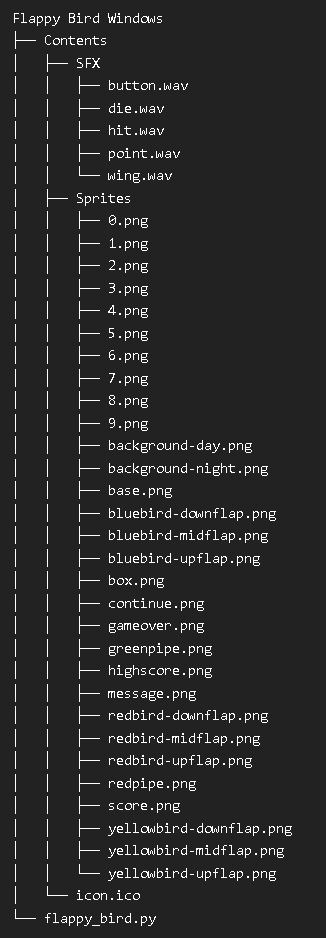
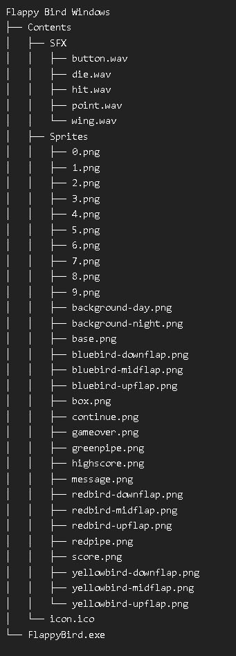

# Flappy Bird (Windows Remake)


A faithful recreation of the classic Flappy Bird game with Python and Pygame.

## Features
- **Original** gameplay mechanics
- Day/night backgrounds (changes automatically)
- Three bird color variants
- Score tracking with local high scores
- Responsive controls (spacebar **or** mouse click)

## Installation

1. **Requirements**:
   - Python 3.10+
   - Pygame

2. **Install dependencies**:
   ```bash
   pip install -r requirements.txt
   ```
   
## How to Play
- Press SPACE or click to flap
- Avoid pipes
- Try to beat your high score!

## Building the Executable
```bash
pyinstaller --onefile --noconsole --add-data "Contents;Contents" --icon=Contents/icon.ico flappy_bird.py
```


## File Structure (Python Code)


## File Structure (Exe Build)


## Credits
*Original game concept by **Dong Nguyen*** <br>
*Python implementation by **oxyoxy1***

### License
MIT License - See **LICENSE** for details.
